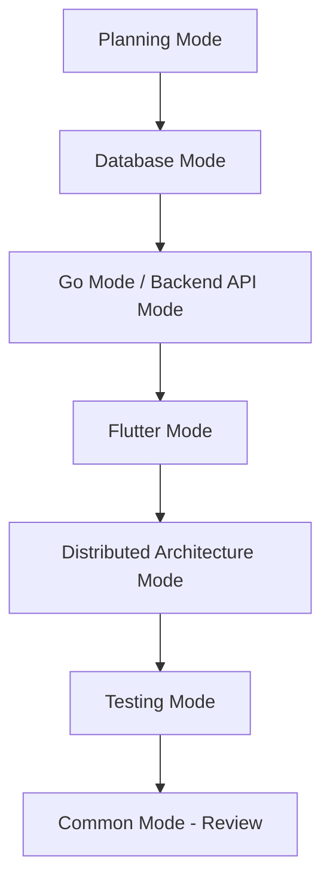

# Hệ thống Quản lý Thư viện Phân tán

Dự án xây dựng hệ thống quản lý thư viện phân tán áp dụng các khái niệm cơ sở dữ liệu phân tán với công nghệ hiện đại.

## 🏗️ Kiến trúc Hệ thống

- **Backend**: Go với MSSQL (qua Parallels trên macOS)
- **Frontend**: Flutter (desktop/web) với Riverpod state management
- **Database**: MSSQL phân tán trên 2 site (Site_TV_Q1, Site_TV_Q3)
- **Concepts**: Phân mảnh ngang, nhân bản toàn bộ, xử lý truy vấn phân tán, 2PC

## 🎯 Chat Modes - Hướng dẫn Sử dụng

Dự án này có 8 chat modes chuyên biệt, mỗi mode được tối ưu cho một khía cạnh cụ thể. Để chuyển đổi giữa các modes, mở Chat view trong VS Code (⌃⌘I) và chọn mode từ dropdown.

### 📋 1. Common Mode - Chế độ Tổng quát

**Khi nào sử dụng**: Khi bạn cần hỗ trợ tổng quát hoặc không chắc chắn nên dùng mode nào

**Ví dụ prompts**:

```text
"Giúp tôi review toàn bộ kiến trúc dự án và đưa ra đề xuất cải tiến"
"Tôi gặp lỗi khi kết nối database, hãy giúp debug"
"Phân tích hiệu suất của hệ thống và đề xuất tối ưu hóa"
```

**Tính năng chính**:

- Phân tích code toàn diện
- Hỗ trợ debug đa nền tảng
- Tích hợp giữa backend và frontend
- Quản lý dự án và documentation

---

### 🎨 2. Flutter Mode - Phát triển Frontend

**Khi nào sử dụng**: Khi làm việc với UI, state management Riverpod, hoặc logic frontend

**Ví dụ prompts**:

```text
"Tạo provider Riverpod để quản lý trạng thái đăng nhập"
"Thiết kế giao diện cho thủ thư với Material Design 3"
"Implement offline-first architecture cho ứng dụng Flutter"
"Tạo widget responsive cho cả desktop và web"
```

**Tính năng chính**:

- Kiến trúc Riverpod providers
- Responsive UI design
- Real-time data synchronization
- Cross-platform compatibility
- Error handling với AsyncValue

---

### 🔧 3. Go Mode - Phát triển Backend

**Khi nào sử dụng**: Khi làm việc với Go services, database operations, hoặc API development

**Ví dụ prompts**:

```text
"Implement repository pattern cho bảng QUYENSACH"
"Tạo middleware authentication với JWT"
"Thiết kế connection pool cho MSSQL trên Parallels"
"Xây dựng distributed query processing engine"
```

**Tính năng chính**:

- Clean architecture patterns
- MSSQL integration
- Microservices design
- Authentication & authorization
- Distributed system logic

---

### 🗄️ 4. Database Mode - Thiết kế CSDL

**Khi nào sử dụng**: Khi thiết kế schema, phân mảnh dữ liệu, hoặc tối ưu query

**Ví dụ prompts**:

```text
"Thiết kế chiến lược phân mảnh ngang cho bảng DOCGIA"
"Implement full replication cho bảng SACH"
"Tối ưu hóa query cross-site cho manager"
"Thiết kế backup strategy cho distributed database"
```

**Tính năng chính**:

- Horizontal fragmentation design
- Full replication strategies
- Query optimization
- Performance tuning
- Data consistency management

---

### 📋 5. Planning Mode - Lập kế hoạch Dự án

**Khi nào sử dụng**: Khi cần lập roadmap, phân tích requirements, hoặc architectural decisions

**Ví dụ prompts**:

```text
"Tạo roadmap 8 tuần cho dự án"
"Phân tích risk và mitigation strategies"
"Thiết kế CI/CD pipeline cho Go và Flutter"
"Lập kế hoạch testing comprehensive"
```

**Tính năng chính**:

- Strategic planning
- Risk assessment
- Technology stack decisions
- Development methodology
- Resource allocation

---

### 🧪 6. Testing Mode - Kiểm thử Hệ thống

**Khi nào sử dụng**: Khi viết tests, debugging, hoặc validation

**Ví dụ prompts**:

```text
"Viết unit test cho Riverpod providers"
"Thiết kế integration test cho distributed transactions"
"Tạo mock data cho testing environment"
"Implement load testing cho distributed queries"
```

**Tính năng chính**:

- Unit & integration testing
- Riverpod testing strategies
- Distributed system testing
- Performance testing
- Mock data generation

---

### 🏛️ 7. Distributed Architecture Mode - Kiến trúc Phân tán

**Khi nào sử dụng**: Khi cần implement các concepts phân tán phức tạp

**Ví dụ prompts**:

```text
"Implement Two-Phase Commit protocol"
"Thiết kế site coordination mechanism"
"Optimize inter-site communication"
"Design distributed deadlock detection"
```

**Tính năng chính**:

- Advanced distributed concepts
- Site architecture design
- Performance optimization
- Network protocols
- Fault tolerance

---

### 🚀 8. Backend API Mode - Phát triển API

**Khi nào sử dụng**: Khi thiết kế RESTful APIs, microservices, hoặc Go-specific tasks

**Ví dụ prompts**:

```text
"Thiết kế RESTful API cho book borrowing"
"Implement rate limiting và caching"
"Tạo OpenAPI documentation"
"Setup Docker containerization"
```

**Tính năng chính**:

- RESTful API design
- Microservices architecture
- Go best practices
- Deployment strategies
- API documentation

## 💡 Mẹo Sử dụng Hiệu quả

### 🎯 Lựa chọn Mode phù hợp

1. **Bắt đầu dự án** → Planning Mode
2. **Thiết kế database** → Database Mode
3. **Code Go backend** → Go Mode hoặc Backend API Mode
4. **Code Flutter frontend** → Flutter Mode
5. **Implement distributed concepts** → Distributed Architecture Mode
6. **Viết tests** → Testing Mode
7. **Tổng quát/không chắc chắn** → Common Mode

### 📝 Viết Prompts Hiệu quả

**✅ Tốt**:

```text
"Tạo Riverpod provider để quản lý state authentication với JWT tokens, 
bao gồm login, logout, và refresh token logic"
```

**❌ Không tốt**:

```text
"Tạo provider"
```

**✅ Tốt**:

```text
"Implement horizontal fragmentation cho bảng QUYENSACH theo MaCN, 
bao gồm query routing và result aggregation"
```

**❌ Không tốt**:

```text
"Làm fragmentation"
```

### 🔄 Workflow Đề xuất

1. **Planning Mode**: Tạo roadmap và phân tích requirements
2. **Database Mode**: Thiết kế schema và distribution strategy
3. **Backend API Mode**: Xây dựng Go services và APIs
4. **Flutter Mode**: Phát triển UI với Riverpod
5. **Distributed Architecture Mode**: Implement advanced concepts
6. **Testing Mode**: Comprehensive testing
7. **Common Mode**: Integration và final review

## 🚀 Hướng dẫn Bắt đầu Nhanh

### Bước 1: Thiết lập Chat Modes

1. Mở VS Code trong workspace này
2. Bấm `⌃⌘I` (Ctrl+Alt+I trên Windows/Linux) để mở Chat view
3. Chọn chat mode từ dropdown ở đầu cửa sổ chat

### Bước 2: Workflow Đề xuất cho Người mới



### Bước 3: Ví dụ Chat Session

**Scenario**: Bạn muốn tạo tính năng mượn sách

1. **Planning Mode**: "Tạo implementation plan cho tính năng mượn sách với distributed transaction"
2. **Database Mode**: "Thiết kế schema cho bảng PHIEUMUON với fragmentation strategy"
3. **Backend API Mode**: "Implement REST API endpoint cho book borrowing với 2PC"
4. **Flutter Mode**: "Tạo UI cho librarian để scan book và borrow cho reader"
5. **Testing Mode**: "Viết comprehensive tests cho borrowing flow"

### Bước 4: Tips để Tối ưu hóa Trải nghiệm

1. **Luôn cung cấp context**: Đề cập đến role (THUTHU/QUANLY), site (Q1/Q3)
2. **Specific requirements**: Nêu rõ constraints về distributed systems
3. **Technology preferences**: Nhắc đến Riverpod, Go patterns, MSSQL specifics
4. **Follow-up questions**: Đặt câu hỏi follow-up để clarify requirements

### 🎯 Scenarios Thực tế

#### Scenario 1: Database Design

```text
Mode: Database Mode
Prompt: "Thiết kế distributed schema cho library system với:
- 2 sites: Q1 và Q3
- Horizontal fragmentation cho DOCGIA theo MaCN_DangKy
- Full replication cho SACH và CHINHANH
- Optimize cho query performance"
```

#### Scenario 2: Frontend Development

```text
Mode: Flutter Mode
Prompt: "Tạo Riverpod provider architecture cho:
- AuthProvider với role-based access (THUTHU/QUANLY)
- BookProvider với cross-site search capability
- BorrowingProvider với real-time status updates
- Sử dụng AsyncValue cho error handling"
```

#### Scenario 3: Backend Services

```text
Mode: Backend API Mode
Prompt: "Implement Go microservice cho book borrowing với:
- Repository pattern cho MSSQL access
- JWT authentication middleware
- Distributed transaction với 2PC protocol
- Circuit breaker cho site communication"
```

### 🆘 Troubleshooting

**Q**: Chat mode không hiển thị?
**A**: Kiểm tra file `.github/chatmodes/*.chatmode.md` có tồn tại và syntax đúng

**Q**: Tools không hoạt động?
**A**: Kiểm tra MCP configuration trong `.vscode/mcp.json`

**Q**: Không chắc chắn dùng mode nào?
**A**: Bắt đầu với Common Mode, sau đó chuyển sang mode chuyên biệt

**Q**: Muốn customize chat mode?
**A**: Copy một mode hiện có, sửa tools và instructions theo nhu cầu

---

💡 **Pro Tip**: Bookmark README này và thường xuyên tham khảo để sử dụng chat modes một cách hiệu quả nhất!
