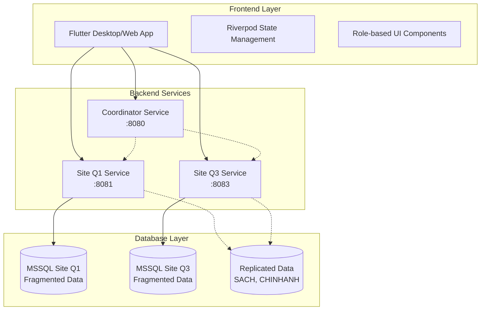
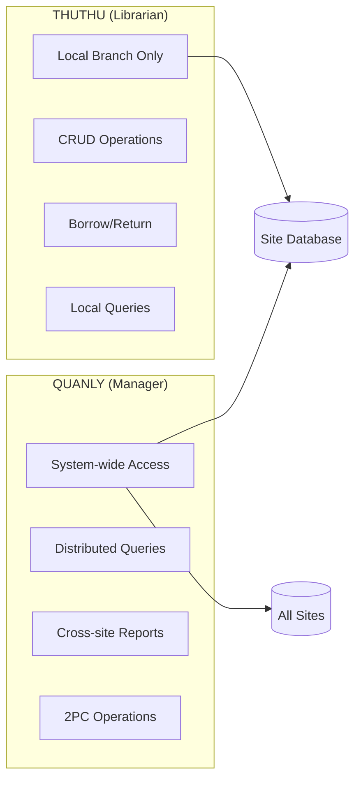
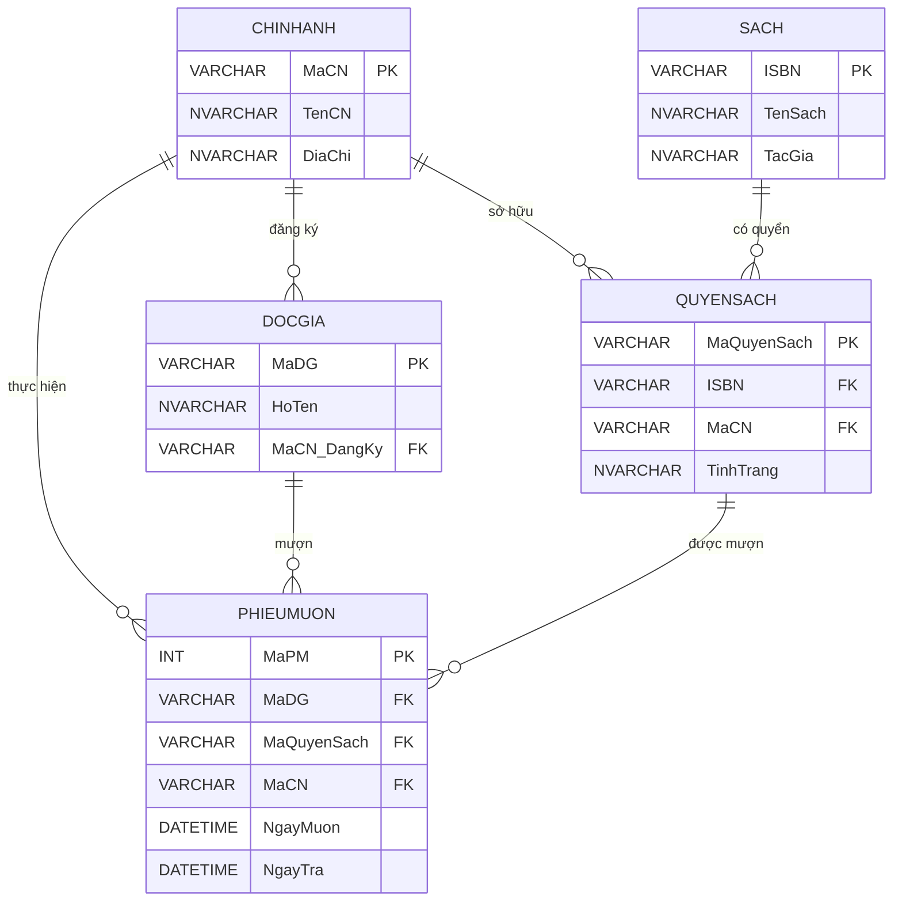

# Hệ thống Quản lý Thư viện Phân tán

[](https://golang.org/)
[](https://flutter.dev/)
[](https://www.microsoft.com/en-us/sql-server)
[](LICENSE)

Hệ thống quản lý thư viện đa chi nhánh sử dụng kiến trúc cơ sở dữ liệu phân tán

## Mục lục

- [Giới thiệu](#giới-thiệu)
- [Tính năng](#tính-năng)
- [Kiến trúc hệ thống](#kiến-trúc-hệ-thống)
- [Công nghệ sử dụng](#công-nghệ-sử-dụng)
- [Yêu cầu hệ thống](#yêu-cầu-hệ-thống)
- [Cài đặt](#cài-đặt)
- [Cấu hình](#cấu-hình)
- [Sử dụng](#sử-dụng)
- [API Documentation](#api-documentation)
- [Database Schema](#database-schema)
- [Testing](#testing)
- [Deployment](#deployment)
- [Troubleshooting](#troubleshooting)
- [Đóng góp](#đóng-góp)
- [License](#license)

## Giới thiệu

Hệ thống Quản lý Thư viện Phân tán là một dự án học thuật triển khai các khái niệm cốt lõi của cơ sở dữ liệu phân tán (Distributed Database Management Systems). Hệ thống mô phỏng hoạt động của một chuỗi thư viện đa chi nhánh với 2 site chính: **Site Q1** (Quận 1) và **Site Q3** (Quận 3).

### Mục tiêu học thuật

- **Phân mảnh dữ liệu (Data Fragmentation)**: Triển khai phân mảnh ngang theo chi nhánh
- **Nhân bản dữ liệu (Data Replication)**: Nhân bản toàn bộ cho dữ liệu dùng chung
- **Xử lý truy vấn phân tán**: Truy vấn và tổng hợp kết quả từ nhiều site
- **Giao dịch phân tán**: Giao thức 2PC (Two-Phase Commit)
- **Kiểm soát truy cập**: Phân quyền dựa trên vai trò người dùng
- **Tính trong suốt**: Ẩn độ phức tạp phân tán khỏi người dùng cuối

## Tính năng

### Dành cho Thủ thư (THUTHU)

- ✅ **Quản lý mượn/trả sách** tại chi nhánh
- ✅ **CRUD độc giả** cục bộ với auto-assignment
- ✅ **CRUD quyển sách** cục bộ với business rules
- ✅ **Tìm kiếm và lọc** dữ liệu chi nhánh
- ✅ **Validation** và error handling toàn diện

### Dành cho Quản lý (QUANLY)

- ✅ **Thống kê toàn hệ thống** với distributed queries
- ✅ **Tìm kiếm sách cross-site** với aggregated results
- ✅ **CRUD đầu sách** toàn hệ thống (2PC protocol)
- ✅ **Chuyển sách giữa chi nhánh** với distributed transactions
- ✅ **Báo cáo và analytics** từ multiple sites

### Bảo mật và Kiểm soát

- ✅ **JWT Authentication** với role-based access
- ✅ **SQL Server Authentication** tích hợp
- ✅ **Role-based UI rendering** và business logic
- ✅ **Data isolation** theo chi nhánh và vai trò

## Kiến trúc hệ thống

### Distributed Database Architecture



### Data Distribution Strategy

| Bảng | Chiến lược | Khóa phân mảnh | Mô tả |
|------|------------|----------------|-------|
| `CHINHANH` | **Nhân bản toàn bộ** | - | Thông tin chi nhánh trên tất cả sites |
| `SACH` | **Nhân bản toàn bộ** | - | Catalog sách toàn hệ thống |
| `QUYENSACH` | **Phân mảnh ngang** | `MaCN` | Quyển sách vật lý theo chi nhánh |
| `DOCGIA` | **Phân mảnh ngang** | `MaCN_DangKy` | Độc giả theo nơi đăng ký |
| `PHIEUMUON` | **Phân mảnh ngang** | `MaCN` | Phiếu mượn theo nơi thực hiện |

### Role-Based Access Control



## Công nghệ sử dụng

### Backend

- **[Go 1.24.2](https://golang.org/)** - Core backend services
- **[Gin Framework](https://gin-gonic.com/)** - HTTP web framework
- **[MSSQL Driver](https://github.com/denisenkom/go-mssqldb)** - Database connectivity
- **[JWT-Go](https://github.com/golang-jwt/jwt)** - Authentication
- **[Swagger](https://swagger.io/)** - API documentation

### Frontend

- **[Flutter 3.8.1](https://flutter.dev/)** - Cross-platform UI framework
- **[Riverpod 2.6.1](https://riverpod.dev/)** - State management
- **[Go Router](https://pub.dev/packages/go_router)** - Navigation
- **[Chopper](https://pub.dev/packages/chopper)** - HTTP client
- **[Material Design 3](https://m3.material.io/)** - UI components

### Database

- **[Microsoft SQL Server](https://www.microsoft.com/sql-server)** - Primary database
- **[Parallels Desktop](https://www.parallels.com/)** - VM hosting (macOS)

### Development Tools

- **[VS Code](https://code.visualstudio.com/)** - Primary IDE
- **[MCP (Model Context Protocol)](https://modelcontextprotocol.io/)** - AI-assisted development
- **[Git](https://git-scm.com/)** - Version control

## Yêu cầu hệ thống

### Phần cứng tối thiểu

- **RAM**: 8GB+ (khuyến nghị 16GB cho VM)
- **Ổ cứng**: 20GB trống
- **CPU**: Dual-core 2.5GHz+

### Phần mềm yêu cầu

- **macOS 10.15+** hoặc **Windows 10+** hoặc **Linux**
- **[Go 1.21+](https://golang.org/dl/)**
- **[Flutter 3.8.1+](https://flutter.dev/docs/get-started/install)**
- **[Git](https://git-scm.com/downloads)**

### Database Setup

- **Microsoft SQL Server 2019+**
- **SQL Server Management Studio** (SSMS)
- **Parallels Desktop** (cho macOS users)

## Cài đặt

### 1. Clone Repository

```bash
git clone https://github.com/zoroONE01/library_distributed_system.git
cd library_distributed_system
```

### 2. Setup toàn bộ hệ thống

```bash
# Cài đặt và build tất cả components
make

# Hoặc cài đặt từng phần
make server  # Backend only
make app     # Frontend only
```

### 3. Database Setup

#### Tạo databases

```sql
-- Kết nối SSMS và tạo databases
CREATE DATABASE Site_TV_Q1;
CREATE DATABASE Site_TV_Q3;
```

#### Chạy migration scripts

```bash
# Import schema và data
sqlcmd -S localhost -d Site_TV_Q1 -i docs/migration_script_q1.sql
sqlcmd -S localhost -d Site_TV_Q3 -i docs/migration_script_q3.sql
```

### 4. Environment Configuration

Tạo file `.env` trong `library_distributed_server/`:

```env
# Database Configuration
DB_SERVER=localhost
DB_PORT=1433
DB_USER=sa
DB_PASSWORD=YourPassword123

# JWT Configuration  
JWT_SECRET=distributed-library-system-secret-key-2024
JWT_TOKEN_EXPIRY=24h

# Server Configuration
SITE_Q1_PORT=8081
SITE_Q3_PORT=8083
COORDINATOR_PORT=8080
```

## Cấu hình

### Backend Services Configuration

Mỗi service có thể được cấu hình thông qua environment variables:

```bash
# Site Q1 Service
export SITE_CODE=Q1
export DB_NAME=Site_TV_Q1
export SERVER_PORT=8081

# Site Q3 Service  
export SITE_CODE=Q3
export DB_NAME=Site_TV_Q3
export SERVER_PORT=8083

# Coordinator Service
export SERVER_PORT=8080
export ENABLE_2PC=true
```

### Frontend Configuration

Cấu hình API endpoints trong `lib/core/api/api_client.dart`:

```dart
class ApiConfig {
  static const String siteQ1BaseUrl = 'http://localhost:8081';
  static const String siteQ3BaseUrl = 'http://localhost:8083';
  static const String coordinatorBaseUrl = 'http://localhost:8080';
}
```

## Sử dụng

### 1. Khởi động Backend Services

```bash
# Start tất cả services
make start

# Hoặc start manual
cd library_distributed_server
make run
```

Services sẽ chạy trên:

- **Site Q1**: <http://localhost:8081>
- **Site Q3**: <http://localhost:8083>
- **Coordinator**: <http://localhost:8080>

### 2. Khởi động Frontend

```bash
cd library_distributed_app

# Desktop app
flutter run -d macos

# Web app  
flutter run -d chrome --web-port 3000
```

### 3. Đăng nhập hệ thống

#### Test Accounts

| Username | Password | Role | Access |
|----------|----------|------|--------|
| `ThuThu_Q1` | `ThuThu123@` | THUTHU | Site Q1 only |
| `ThuThu_Q3` | `ThuThu123@` | THUTHU | Site Q3 only |
| `QuanLy` | `QuanLy456@` | QUANLY | All sites |

### 4. Workflow Examples

#### Thủ thư - Lập phiếu mượn sách

1. Đăng nhập với tài khoản `ThuThu_Q1`
2. Vào module **Borrowing Management**
3. Click **"Lập phiếu mượn"**
4. Nhập Mã độc giả và Mã quyển sách
5. Hệ thống tự động validate và tạo phiếu

#### Quản lý - Tìm kiếm sách toàn hệ thống

1. Đăng nhập với tài khoản `QuanLy`
2. Vào module **Book Search**
3. Nhập tên sách cần tìm
4. Xem kết quả từ tất cả chi nhánh
5. Thực hiện chuyển sách nếu cần

## API Documentation

### Swagger UI Endpoints

- **Site Q1 API**: <http://localhost:8081/swagger/index.html>
- **Site Q3 API**: <http://localhost:8083/swagger/index.html>
- **Coordinator API**: <http://localhost:8080/swagger/index.html>

### Core API Endpoints

#### Authentication

```http
POST /api/auth/login
Content-Type: application/json

{
  "username": "ThuThu_Q1",
  "password": "ThuThu123@"
}
```

#### Distributed Queries (QUANLY only)

```http
GET /api/books/search-system-wide?title=Lược%20sử%20loài%20người
Authorization: Bearer <jwt_token>
```

#### 2PC Operations (Book Transfer)

```http
POST /api/coordinator/transfer-book
Authorization: Bearer <jwt_token>
Content-Type: application/json

{
  "bookCopyId": "QS_Q1_001", 
  "fromBranch": "Q1",
  "toBranch": "Q3"
}
```

### Error Handling

API trả về standardized error responses:

```json
{
  "error": true,
  "message": "Quyển sách đang được mượn",
  "code": "BOOK_CURRENTLY_BORROWED",
  "details": {
    "bookCopyId": "QS_Q1_001",
    "currentStatus": "Đang được mượn"
  }
}
```

## Database Schema

### Entity Relationship Diagram



### Fragmentation Strategy

```sql
-- Horizontal Fragmentation Examples

-- Fragment 1: Site Q1
SELECT * FROM QUYENSACH WHERE MaCN = 'Q1';
SELECT * FROM DOCGIA WHERE MaCN_DangKy = 'Q1'; 
SELECT * FROM PHIEUMUON WHERE MaCN = 'Q1';

-- Fragment 2: Site Q3
SELECT * FROM QUYENSACH WHERE MaCN = 'Q3';
SELECT * FROM DOCGIA WHERE MaCN_DangKy = 'Q3';
SELECT * FROM PHIEUMUON WHERE MaCN = 'Q3';

-- Replicated on all sites
SELECT * FROM SACH;     -- Full replication
SELECT * FROM CHINHANH; -- Full replication
```

## Testing

### Unit Tests

```bash
# Backend tests
cd library_distributed_server
go test ./...

# Frontend tests  
cd library_distributed_app
flutter test
```

### Integration Tests

```bash
# API Integration tests
cd library_distributed_server
go test ./test/integration/...

# Widget tests
cd library_distributed_app  
flutter test integration_test/
```

### Test Scenarios

#### Distributed Transaction Testing

1. **2PC Success**: Transfer book between branches
2. **2PC Failure**: Network failure during commit phase
3. **Rollback**: Transaction abort and data consistency

#### Access Control Testing

1. **THUTHU Isolation**: Cannot access other branch data
2. **QUANLY Access**: Can query all sites
3. **Authentication**: Invalid credentials handling

#### Data Consistency Testing

1. **Fragmentation**: Data appears only on correct sites
2. **Replication**: Changes propagate to all replicas
3. **Concurrency**: Multiple users modifying same data

## Deployment

### Development Environment

```bash
# Start development servers
make start

# Watch mode for frontend
cd library_distributed_app
flutter run -d chrome --web-port 3000
```

### Production Build

```bash
# Build backend binaries
cd library_distributed_server
make build

# Build Flutter for web
cd library_distributed_app
flutter build web --release

# Build Flutter for desktop
flutter build macos --release
```

### Docker Deployment (Optional)

```dockerfile
# Dockerfile example for backend service
FROM golang:1.24-alpine AS builder
WORKDIR /app
COPY . .
RUN go mod download
RUN go build -o site-q1 ./cmd/site-q1

FROM alpine:latest
RUN apk --no-cache add ca-certificates
WORKDIR /root/
COPY --from=builder /app/site-q1 .
EXPOSE 8081
CMD ["./site-q1"]
```

### Environment-specific Configuration

```bash
# Development
export ENVIRONMENT=development
export LOG_LEVEL=debug

# Production  
export ENVIRONMENT=production
export LOG_LEVEL=info
export ENABLE_CORS=false
```

## Troubleshooting

### Common Issues

#### 1. Database Connection Failed

```bash
# Check SQL Server status
systemctl status mssql-server

# Test connection
sqlcmd -S localhost -U sa -P YourPassword123
```

**Solution**:

- Verify SQL Server is running
- Check firewall settings
- Validate connection string

#### 2. Flutter Build Errors

```bash
# Clean and rebuild
flutter clean
flutter pub get
flutter packages pub run build_runner build --delete-conflicting-outputs
```

#### 3. JWT Authentication Failed

```bash
# Check JWT secret configuration
echo $JWT_SECRET

# Verify token expiry
echo $JWT_TOKEN_EXPIRY
```

#### 4. Port Already in Use

```bash
# Find process using port
lsof -i :8081

# Kill process
kill -9 <PID>
```

### Debug Mode

#### Backend Debug

```bash
# Enable debug logging
export LOG_LEVEL=debug
export GIN_MODE=debug

# Run with race detection
go run -race ./cmd/site-q1/main.go
```

#### Frontend Debug

```bash
# Run in debug mode
flutter run --debug

# Enable inspector
flutter run --dart-define=ENABLE_DEBUG=true
```

### Performance Monitoring

```bash
# Backend metrics
curl http://localhost:8081/metrics

# Database query profiling
sqlcmd -S localhost -Q "SET STATISTICS IO ON; <your_query>"
```

## Đóng góp

### Development Workflow

1. **Fork** repository
2. **Create feature branch**: `git checkout -b feature/amazing-feature`
3. **Commit changes**: `git commit -m 'Add amazing feature'`
4. **Push to branch**: `git push origin feature/amazing-feature`
5. **Create Pull Request**

### Code Style Guidelines

#### Go Backend

```bash
# Format code
go fmt ./...

# Run linter
golangci-lint run

# Vet code
go vet ./...
```

#### Flutter Frontend

```bash
# Analyze code
flutter analyze

# Format code
dart format .

# Run linter
flutter packages pub run flutter_lints
```

### Commit Message Convention

```text
feat: add book transfer functionality
fix: resolve authentication timeout issue
docs: update API documentation
style: format code according to style guide
refactor: improve query performance
test: add integration tests for 2PC
chore: update dependencies
```

### Issue Templates

#### Bug Report

```markdown
**Describe the bug**
A clear description of the bug.

**To Reproduce**
Steps to reproduce the behavior.

**Expected behavior**
What you expected to happen.

**Environment**
- OS: [e.g. macOS 12.0]
- Go version: [e.g. 1.24.2]
- Flutter version: [e.g. 3.8.1]
```

#### Feature Request

```markdown
**Feature Description**
A clear description of the feature.

**Use Case**
Why this feature would be useful.

**Proposed Implementation**
How you think this could be implemented.
```

## License

Dự án này được phát triển cho mục đích học thuật tại **Trường Đại học Khoa học Tự nhiên - ĐHQG TP.HCM**.

```text
MIT License

Copyright (c) 2025 Library Distributed System

Permission is hereby granted, free of charge, to any person obtaining a copy
of this software and associated documentation files (the "Software"), to deal
in the Software without restriction, including without limitation the rights
to use, copy, modify, merge, publish, distribute, sublicense, and/or sell
copies of the Software, and to permit persons to whom the Software is
furnished to do so, subject to the following conditions:

The above copyright notice and this permission notice shall be included in all
copies or substantial portions of the Software.

THE SOFTWARE IS PROVIDED "AS IS", WITHOUT WARRANTY OF ANY KIND, EXPRESS OR
IMPLIED, INCLUDING BUT NOT LIMITED TO THE WARRANTIES OF MERCHANTABILITY,
FITNESS FOR A PARTICULAR PURPOSE AND NONINFRINGEMENT. IN NO EVENT SHALL THE
AUTHORS OR COPYRIGHT HOLDERS BE LIABLE FOR ANY CLAIM, DAMAGES OR OTHER
LIABILITY, WHETHER IN AN ACTION OF CONTRACT, TORT OR OTHERWISE, ARISING FROM,
OUT OF OR IN CONNECTION WITH THE SOFTWARE OR THE USE OR OTHER DEALINGS IN THE
SOFTWARE.
```

---

## Liên hệ và Hỗ trợ

### Developer

- **GitHub**: [@zoroONE01](https://github.com/zoroONE01)
- **Email**: <contact@yourdomain.com>

### Documentation

- **Project Wiki**: [GitHub Wiki](https://github.com/zoroONE01/library_distributed_system/wiki)
- **API Docs**: [Swagger UI](http://localhost:8081/swagger/index.html)
- **Database Docs**: [docs/database_implement.md](docs/database_implement.md)

### Academic References

- **Distributed Database Systems**: A Practical Approach (3rd Edition)
- **Database System Concepts** - Silberschatz, Galvin, Gagne
- **Distributed Systems**: Principles and Paradigms - Tanenbaum & Van Steen

---

[⬆️ Back to top](#hệ-thống-quản-lý-thư-viện-phân-tán)
